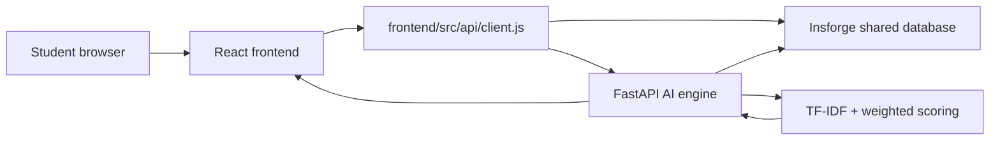
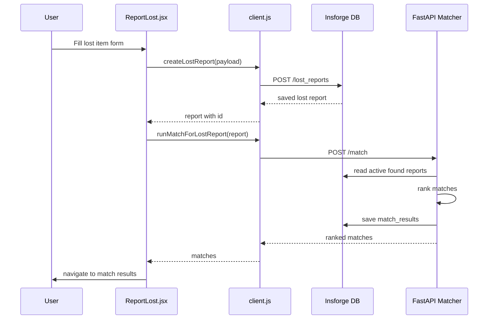
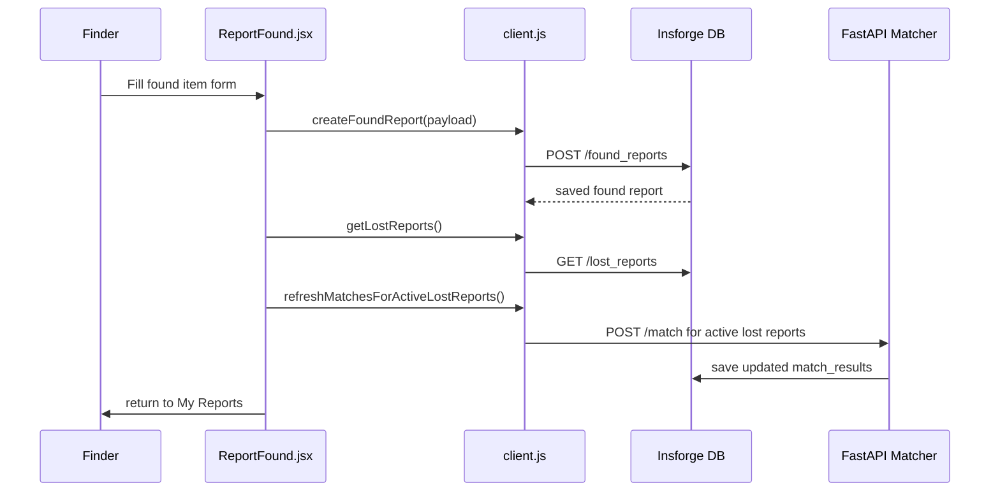

# Campus Lost-and-Found Matcher: Codebase Guide and Team Tasks

## 1. Project Concept

Campus Lost-and-Found Matcher is a full-stack web application for reporting lost and found items on campus, then ranking possible matches between them.

The main idea is simple:

1. A student submits a lost item report.
2. Another student or staff member submits a found item report.
3. The matching engine compares lost reports against found reports.
4. The system returns ranked matches with confidence scores and human-readable explanations.
5. The frontend displays the reports, the best match summary, and the detailed match breakdown.

The project is not just a form application. Its core value is the AI-style scoring pipeline: it compares category, description, color, location, and time proximity to estimate how likely a found item belongs to a lost report.

## 2. High-Level Architecture

The application has three main layers:

| Layer | Folder | Responsibility |
| --- | --- | --- |
| Frontend | `frontend/` | React UI, forms, report lists, match results, API calls |
| AI/API Engine | `ai-engine/` | FastAPI backend, matching endpoint, classifier endpoint, report gateway |
| Shared Database | Insforge/PostgreSQL | Stores shared lost reports, found reports, and match results |

The intended production flow is:



The important point for collaboration is that reports must be stored in the shared database, not in browser local storage. If a report is stored locally, only the person using that browser can see it. Shared visibility requires Insforge or another shared backend service.

## 3. Core Data Model

The project uses three main tables.

### `lost_reports`

Stores reports created by students who lost an item.

Important fields:

| Field | Meaning |
| --- | --- |
| `id` | Unique report ID |
| `student_id` | User/student identifier |
| `category` | Item category such as `keys`, `charger`, `bottle` |
| `description` | Free-text item description |
| `color` | Optional item color |
| `location_lost` | Where the item was lost |
| `time_lost` | When the item was lost |
| `status` | `active`, `matched`, or `closed` |
| `created_at` | Report creation time |

### `found_reports`

Stores reports created by students/staff who found an item.

Important fields:

| Field | Meaning |
| --- | --- |
| `id` | Unique report ID |
| `student_id` | Finder identifier |
| `category` | Item category |
| `description` | Free-text item description |
| `color` | Optional item color |
| `location_found` | Where the item was found |
| `time_found` | When the item was found |
| `finder_contact` | Email or phone for contacting finder |
| `status` | `active`, `matched`, or `closed` |
| `created_at` | Report creation time |

### `match_results`

Stores ranked match suggestions.

Important fields:

| Field | Meaning |
| --- | --- |
| `id` | Unique match result ID |
| `lost_report_id` | Lost report being matched |
| `found_report_id` | Found report candidate |
| `confidence_score` | Score between 0 and 1 |
| `explanation` | Human-readable reason |
| `feature_scores` | JSON breakdown of text/category/color/location/time scores |
| `created_at` | Match result creation time |

## 4. Frontend Core Files

### `frontend/src/api/client.js`

This is the most important frontend integration file.

It defines all network calls used by the UI:

| Function | Purpose |
| --- | --- |
| `createLostReport(data)` | Saves a lost report |
| `getLostReports()` | Loads lost reports for the My Reports page |
| `getLostReport(id)` | Loads one lost report |
| `createFoundReport(data)` | Saves a found report |
| `getFoundReports()` | Loads found reports |
| `findMatches(payload)` | Calls the AI engine `/match` endpoint |
| `getMatches(lostId)` | Loads saved match results |
| `toMatchPayload(lostReport)` | Converts a lost report into the AI match request shape |
| `runMatchForLostReport(lostReport)` | Runs the matcher for one report |
| `refreshMatchesForActiveLostReports(lostReports)` | Runs matcher for multiple active reports |

Mechanism:

1. Report CRUD can go directly to Insforge when `VITE_INSFORGE_DB_BASE_URL` is configured.
2. Matching goes through FastAPI because the AI logic lives in Python.
3. The frontend never stores reports in local storage now. That prevents private, one-device-only report data.

### `frontend/src/pages/ReportLost.jsx`

This page is the lost item form.

Main responsibilities:

1. Collect item category, description, color, location, and time.
2. Optionally call `/classify` to guess the item category from the description.
3. Submit the lost report through `createLostReport`.
4. Run matching through `runMatchForLostReport`.
5. Navigate to `/matches/:lostId`.

Important design point:

Saving the report and running the matcher are separate. If the report saves successfully but matching fails, the report is still valid and should remain visible to collaborators.

### `frontend/src/pages/ReportFound.jsx`

This page is the found item form.

Main responsibilities:

1. Collect found item category, description, color, location, time, and finder contact.
2. Submit the found report through `createFoundReport`.
3. Refresh matches for active lost reports because a new found item may match old lost reports.
4. Navigate back to My Reports.

### `frontend/src/pages/MyReports.jsx`

This page lists lost reports and now also shows the strongest found-report match for each lost report.

Main responsibilities:

1. Load lost reports through `getLostReports()`.
2. For each active lost report, load saved matches through `getMatches(report.id)`.
3. If no saved matches exist, run matching through `runMatchForLostReport(report)`.
4. Store matches in Zustand with `setMatchResults(report.id, matches)`.
5. Display a best-match panel when the top match score is high enough.

High-match threshold:

```js
const HIGH_MATCH_THRESHOLD = 0.4
```

This means a match with score `0.40` or higher appears as a highlighted best found match inside the report card. Lower matches still exist in the full match page, but they are shown as below the high-confidence threshold.

### `frontend/src/pages/MatchResults.jsx`

This page shows all match candidates for one lost report.

Flow:

1. Read `lostId` from the route.
2. Load the lost report.
3. Load cached matches if available.
4. Otherwise call `/match`.
5. Render a list of `MatchCard` components.

### `frontend/src/pages/MatchDetail.jsx`

This page shows the detailed breakdown for one match.

It displays:

1. Overall confidence score.
2. Feature scores.
3. Match explanation.
4. Finder contact.

If the user refreshes the page and Zustand memory is empty, it reloads matches from `getMatches(lostId)`.

### `frontend/src/store/useStore.js`

This is the Zustand store.

It stores frontend state:

| State | Meaning |
| --- | --- |
| `lostReports` | Loaded lost reports |
| `foundReports` | Loaded found reports |
| `matchResults` | Matches keyed by `lost_report_id` |
| `toast` | Notification message |
| `loading` | Shared loading state |

## 5. AI Engine Core Files

### `ai-engine/main.py`

This is the FastAPI application entry point.

Main endpoints:

| Endpoint | Method | Purpose |
| --- | --- | --- |
| `/health` | GET | Backend health check |
| `/lost-reports` | POST | Create lost report |
| `/lost-reports` | GET | List lost reports |
| `/lost-reports/{id}` | GET | Get one lost report |
| `/found-reports` | POST | Create found report |
| `/found-reports` | GET | List found reports |
| `/found-reports/{id}` | GET | Get one found report |
| `/match-results/{lost_report_id}` | GET | Load saved match results |
| `/match` | POST | Run AI matching |
| `/classify` | POST | Predict category from text |

Important behavior:

1. If the shared database is configured, CRUD routes use the shared database.
2. If the database is unavailable, the API returns an error instead of silently pretending reports are shared.
3. `/match` fetches active found reports, ranks them, stores the match results, and returns the ranked list.

### `ai-engine/matcher/db.py`

This file is the database connector.

It talks to Insforge through REST endpoints.

Main functions:

| Function | Purpose |
| --- | --- |
| `create_lost_report(payload)` | Insert lost report |
| `list_lost_reports()` | List lost reports |
| `get_lost_report(report_id)` | Fetch one lost report |
| `create_found_report(payload)` | Insert found report |
| `list_found_reports()` | List found reports |
| `get_found_report(report_id)` | Fetch one found report |
| `fetch_active_found_reports()` | Fetch active found reports and convert them into `FoundItem` objects |
| `save_match_results(lost_report_id, candidates)` | Persist new matches |
| `delete_match_results(lost_report_id)` | Remove stale match results before saving fresh ones |
| `fetch_match_results(lost_report_id)` | Load saved matches |

### `ai-engine/matcher/ranker.py`

This file coordinates the full matching pipeline.

Main objects:

| Object | Purpose |
| --- | --- |
| `LostItem` | Dataclass for a lost report |
| `FoundItem` | Dataclass for a found report |
| `MatchCandidate` | Dataclass for ranked match output |
| `rank_matches(lost, found_items)` | Main ranking function |

Pipeline:

1. Fit TF-IDF vectorizer on lost and found descriptions.
2. Compute text similarity for each found report.
3. Compute feature scores for category, color, location, and time.
4. Combine scores with weights.
5. Sort candidates by confidence score.
6. Return top results.

### `ai-engine/matcher/scorer.py`

This file defines the weighted scoring logic.

Weights:

| Feature | Weight |
| --- | --- |
| Text description | `0.40` |
| Category | `0.25` |
| Color | `0.15` |
| Location | `0.12` |
| Time proximity | `0.08` |

Functions:

| Function | Purpose |
| --- | --- |
| `score_category()` | Exact category match |
| `score_color()` | Exact/fuzzy color match |
| `score_location()` | Token overlap between locations |
| `score_time()` | Time proximity score |
| `composite_score()` | Weighted total score |

### `ai-engine/matcher/vectorizer.py`

This file handles text similarity.

It wraps scikit-learn:

1. `TfidfVectorizer`
2. Cosine similarity

The purpose is to compare descriptions like:

```text
Lost: black laptop charger with white tape
Found: black MacBook USB-C charger with tape near adapter
```

The vectorizer converts text into numerical vectors and calculates similarity.

### `ai-engine/matcher/explainer.py`

This file creates human-readable explanations.

Example:

```text
Both reports are categorized as Charger. Item colors match: both listed as black. Locations share some common keywords.
```

This is important because users need to understand why the system suggested a match.

### `ai-engine/classifier/model.py`

This file contains the optional category classifier.

The classifier attempts to predict item category from a text description. If a trained classifier is not available, the API falls back to keyword matching in `main.py`.

## 6. API Mechanism in Detail

The API part is one of the most important core parts of the project.

There are two API layers:

1. Frontend API client: `frontend/src/api/client.js`
2. Backend API service: `ai-engine/main.py`

### 6.1 Frontend API Client

The frontend never calls random URLs directly from pages. Pages import functions from `client.js`.

Example from a page:

```js
const { data } = await createLostReport(payload)
```

This keeps the UI clean. The page does not need to know the full database URL or request headers.

The frontend client knows about:

1. `AI_BASE`: FastAPI service base URL.
2. `DB_BASE`: Insforge database REST URL.
3. `DB_KEY`: optional Insforge API key.

### 6.2 Creating a Lost Report

Frontend flow:



### 6.3 Creating a Found Report

Frontend flow:



### 6.4 Matching API Payload

The matcher expects a lost report shape like:

```json
{
  "lost_report_id": "uuid",
  "description": "black laptop charger with white tape",
  "category": "charger",
  "color": "black",
  "location_lost": "Engineering Lab Room 301",
  "time_lost": "2026-05-09T19:54:00Z"
}
```

This is created by:

```js
toMatchPayload(lostReport)
```

### 6.5 Match API Response

The matcher returns:

```json
{
  "lost_report_id": "uuid",
  "matches": [
    {
      "found_report_id": "uuid",
      "confidence_score": 0.82,
      "explanation": "Both reports are categorized as Charger...",
      "feature_scores": {
        "text_similarity": 0.72,
        "category_match": 1.0,
        "color_match": 1.0,
        "location_match": 0.5,
        "time_proximity": 0.8
      },
      "location_found": "Engineering Lab Room 301",
      "finder_contact": "finder@example.com",
      "category": "charger"
    }
  ],
  "count": 1
}
```

The frontend uses this response in:

1. `MatchResults.jsx`
2. `MatchDetail.jsx`
3. `MyReports.jsx` best-match summary

### 6.6 Why Match Results Are Saved

Match results are saved in the database so:

1. Users can refresh pages without losing results.
2. Collaborators can see the same match state.
3. My Reports can show best matches without rerunning AI every time.
4. The system can audit which found report was suggested for which lost report.

Before saving fresh matches, the backend deletes stale results for the same lost report. That prevents old rankings from mixing with new rankings.

## 7. Matching Algorithm

The ranking engine uses a weighted formula:

```text
Score = text * 0.40
      + category * 0.25
      + color * 0.15
      + location * 0.12
      + time * 0.08
```

### Text Similarity

Uses TF-IDF and cosine similarity.

TF-IDF rewards words that are meaningful in a specific report and reduces the weight of common words.

Cosine similarity measures how close two text vectors are.

### Category Score

Exact category match gets `1.0`.

Example:

```text
lost category = keys
found category = keys
score = 1.0
```

### Color Score

Exact match gets `1.0`. Missing color is treated neutrally, not as a full failure.

### Location Score

Location score uses token overlap.

Example:

```text
Engineering Lab Room 301
Engineering Building Room 301
```

These share important tokens, so they get a positive score.

### Time Score

Time score measures proximity. Reports closer in time get higher scores.

The code uses absolute proximity because a found report may be submitted before the lost report. That can happen when someone finds an item first and the owner reports it later.

## 8. Team Task Split

### Najwa: Frontend Report Forms and UX Flow

Ownership:

1. `frontend/src/pages/ReportLost.jsx`
2. `frontend/src/pages/ReportFound.jsx`
3. `frontend/src/components/Stepper.jsx`
4. Form validation and submit states

Responsibilities:

1. Make sure lost and found forms collect correct fields.
2. Validate required fields before moving between steps.
3. Keep submit buttons disabled while saving.
4. Make error messages clear when the backend is unavailable.
5. Confirm that saved reports navigate to the correct page.

Deliverables:

1. Test lost report submission.
2. Test found report submission.
3. Confirm form data matches database columns.
4. Document any UX edge cases.

### Askar: API Integration and Shared Database Flow

Ownership:

1. `frontend/src/api/client.js`
2. `ai-engine/matcher/db.py`
3. `.env`
4. `frontend/.env.example`

Responsibilities:

1. Maintain all API functions used by the frontend.
2. Ensure reports are saved to the shared Insforge database.
3. Ensure there is no browser-only report storage.
4. Verify Insforge endpoint URLs and headers.
5. Debug 4xx/5xx backend responses.

Deliverables:

1. Confirm `createLostReport` writes to shared DB.
2. Confirm `createFoundReport` writes to shared DB.
3. Confirm collaborators can read the same reports.
4. Keep environment variables documented.

### Abdelrahman: AI Matching Engine

Ownership:

1. `ai-engine/matcher/ranker.py`
2. `ai-engine/matcher/scorer.py`
3. `ai-engine/matcher/vectorizer.py`
4. `ai-engine/matcher/explainer.py`
5. `ai-engine/tests/test_matcher.py`

Responsibilities:

1. Maintain the TF-IDF text matching logic.
2. Tune scoring weights.
3. Keep feature scores between `0.0` and `1.0`.
4. Make explanations accurate and understandable.
5. Expand tests for ranking behavior.

Deliverables:

1. Unit tests for each scoring feature.
2. Example lost/found pairs with expected top matches.
3. Precision@3 evaluation notes.
4. Suggested threshold for high-confidence matches.

### Abdelaziz: FastAPI Backend and Match Persistence

Ownership:

1. `ai-engine/main.py`
2. FastAPI route behavior
3. Match result persistence
4. Error handling

Responsibilities:

1. Maintain backend endpoints.
2. Make sure CRUD routes use the shared DB when configured.
3. Make `/match` fetch active found reports from the DB.
4. Make `/match` save match results.
5. Keep backend errors clear and useful.

Deliverables:

1. Confirm `/health` works.
2. Confirm `/lost-reports` and `/found-reports` work.
3. Confirm `/match` returns ranked results.
4. Confirm `/match-results/{lostId}` returns persisted matches.

### Seif: Reports Dashboard and Match Display

Ownership:

1. `frontend/src/pages/MyReports.jsx`
2. `frontend/src/pages/MatchResults.jsx`
3. `frontend/src/pages/MatchDetail.jsx`
4. `frontend/src/components/MatchCard.jsx`
5. `frontend/src/components/StatusBadge.jsx`

Responsibilities:

1. Display lost reports clearly.
2. Show best high-confidence found match in My Reports.
3. Keep the full match results page readable.
4. Keep match detail feature scores understandable.
5. Ensure responsive layout on desktop and mobile.

Deliverables:

1. My Reports shows best match when score is high.
2. Full match page shows all candidates.
3. Match detail page loads after refresh.
4. No overlapping text or broken layout on mobile.

## 9. Recommended Demo Flow

For a clean team demo:

1. Start with an empty or known database state.
2. Submit a found report first.
3. Submit a matching lost report.
4. Open My Reports.
5. Confirm the lost report displays the best found match.
6. Open View Matches.
7. Open Match Detail.
8. Explain the feature scores.

Example pair:

Found report:

```text
Category: keys
Description: Black Toyota keychain with 3 keys and a remote fob
Color: black
Location Found: Main Building Reception
```

Lost report:

```text
Category: keys
Description: I lost black car keys with Toyota logo and 3 keys attached
Color: black
Location Lost: Main Building Reception
```

Expected result:

The found report should appear as a high-confidence match.

## 10. Current Risks and Notes

1. The shared Insforge endpoint must be online. If it returns `503`, collaborators cannot share reports.
2. The frontend currently embeds the database endpoint. If a private API key is needed, direct frontend DB access should be replaced with FastAPI-only access.
3. Matching quality depends on enough found reports existing in the database.
4. The high-match threshold is currently `0.40`; this can be tuned after testing.
5. If the database schema changes, update both `backend/insforge/migration.sql` and API payload shapes.

